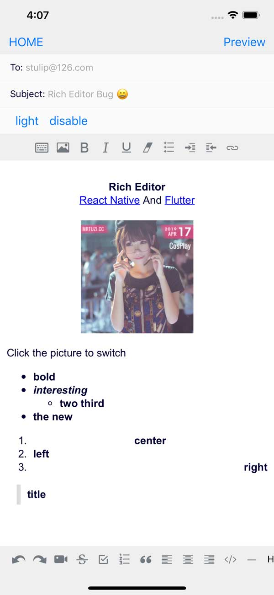

# React Native Rich Text Editor


[](https://www.npmjs.com/package/react-native-pell-rich-editor)

------

> A fully functional Rich Text Editor for both Android and iOS (macOS and windows)?

> If you want to use **flutter**, you can check [here](https://github.com/wxik/flutter-rich-editor) to add **flutter_rich_editor**

```
yarn add react-native-pell-rich-editor
or
npm i react-native-pell-rich-editor
```

Also, follow instructions [here](https://github.com/react-native-community/react-native-webview) to add the native `react-native-webview` dependency.

* [Online Preview](https://wxik.github.io/react-native-rich-editor/web) （Some functions）
* [Example](./examples)

## `RichEditor`
The editor component. Simply place this component in your view hierarchy to receive a fully functional Rich text Editor.

`RichEditor` takes the following optional props:

* `placeholder`

    Wrap the editor content placeholder

* `initialContentHTML`

	HTML that will be rendered in the content section on load.
	
* `initialFocus`	
* Boolean value to Initial content request focus. The default value is `false`.

* `disabled`	
* Boolean value to disable editor. The default value is `false`.

* `editorInitializedCallback `

	A function that will be called when the editor has been initialized.
	
* `editorStyle`

	Styling for container or for Rich Editor more dark or light settings. Object containing the following options:

	- `backgroundColor`: Editor background color
	- `color`: Editor text color
	- `placeholderColor`: Editor placeholder text color
	- `contentCSSText`: editor content css text（initial valid）
	- `cssText`: editor global css text（initial valid）

* `onChange`
    Callback after editor data modification
    
* `onHeightChange`
    Callback after height change 
    
* `useContainer`

	A boolean value that determines if a View container is wrapped around the WebView. The default value is true. If you are using your own View to wrap this library around, set this value to false. 
	
	
`RichEditor` also has methods that can be used on its `ref` to  set:

*  `setContentHTML(html: string)`
*  `insertImage(url: string) `
*  `insertLink(title: string, url: string) `
*  `insertText(text: string)`
*  `insertHTML(html: string)`
*  `insertVideo(url: string)`
*  `setContentFocusHandler(handler: Function)`
*  `blurContentEditor()`
*  `focusContentEditor()`

This method registers a function that will get called whenver the cursor position changes or a change is made to the styling of the editor at the cursor's position., The callback will be called with an array of `actions` that are active at the cusor position, allowing a toolbar to respond to changes.

*  `registerToolbar(listener: Function)` 


### Example Usage:

```javascript
<RichEditor
  ref={(r) => this.richtext = r}
  initialContentHTML={'Hello <b>World</b> <p>this is a new paragraph</p> <p>this is another new paragraph</p>'}
  editorInitializedCallback={() => this.onEditorInitialized()}
/>
```




## `RichToolbar`

This is a Component that provides a toolbar for easily controlling an editor. It is designed to be used together with a `RichEditor` component.

The `RichToolbar` has one required property: 

* `getEditor()`

Which must provide a **function** that returns a `ref` to a `RichEditor` component. 

This is because the `ref` is not created until after the first render, before which the toolbar is rendered. This means that any `ref` passed directly will inevitably be passed as `undefined`.

Other props supported by the `RichToolbar` component are:

* `actions`

	An `array` of `actions` to be provided by this toolbar. The default actions are: 
	* `actions.insertImage`
  	* `actions.setBold`
  	* `actions.setItalic`
  	* `actions.insertBulletsList`
  	* `actions.insertOrderedList`
  	* `actions.insertLink`
  	
* `onPressAddImage`
    Functions called when the `addImage` actions are tapped. 
    
* `onInsertLink`    
    Logic for what happens when you press on the add insert link button

* `disabled`	
* Boolean value to disable editor. The default value is `false`.
        

* `iconTint`
* `unselectedButtonStyle`
* `selectedIconTint`
* `selectedButtonStyle`
* `disabledIconTint`
* `disabledButtonStyle`
    
    These provide options for styling action buttons.

* `iconSize`
    
    Defines the size of the icon in pixels. Default is 50.

* `renderAction`

	Altenatively, you can provide a render function that will be used instead of the default, so you can fully control the tollbar design.
	
	
* `iconMap` 

	`RichTextToolbar` comes with default icons for the default actions it renders. To override those, or to add icons for non-default actions, provide them in a dictionary to this prop.
	
	
### Example Usage:

```javascript
<RichToolbar getEditor={() => this.richtext}/>
```

#### With Custom Action:

To define your own custom action:

-   Send your action name as string in the `actions` array.
-   Include an icon for it with the `iconMap`
-   Add a function prop with the same action name to be called on tap

```javascript
<RichToolbar
	getEditor={() => this.richtext}
	actions={[
		actions.setBold,
		actions.setItalic,
		actions.insertBulletsList,
		actions.insertOrderedList,
		actions.insertImage,
		'customAction',
	]}
	iconMap={{
		customAction: customIcon,
	}}
	customAction={this.handleCustomAction}
/>
```
